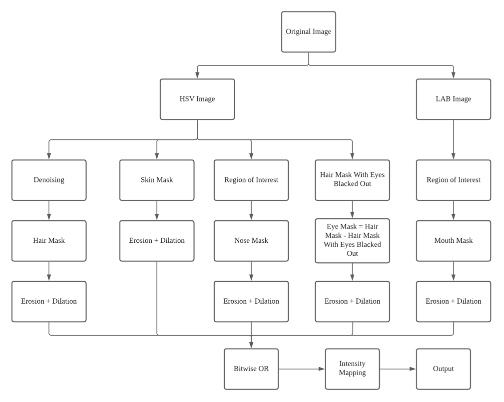
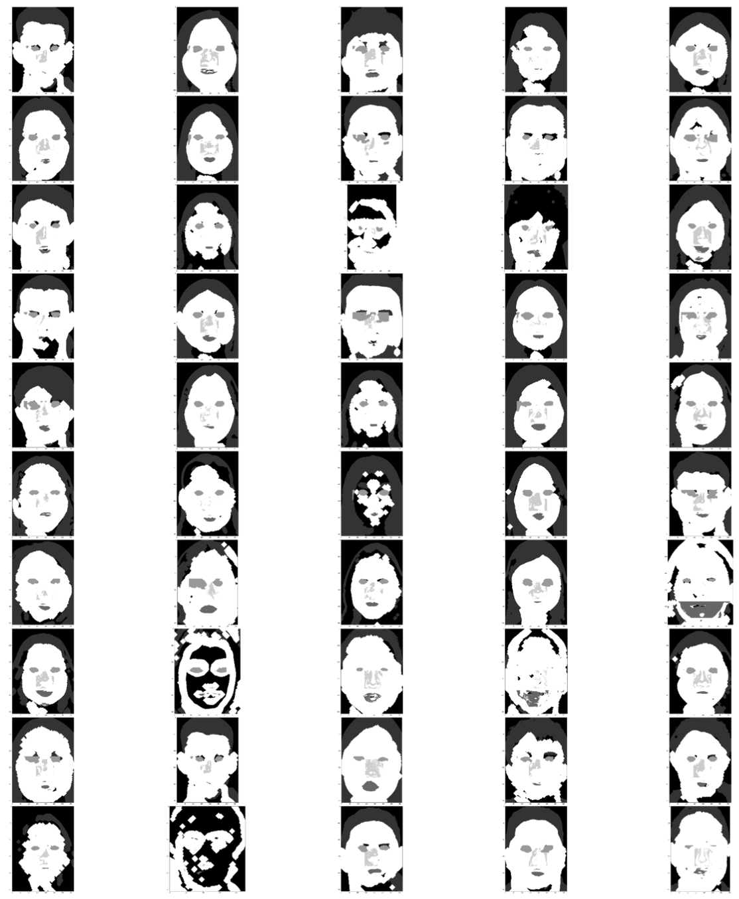
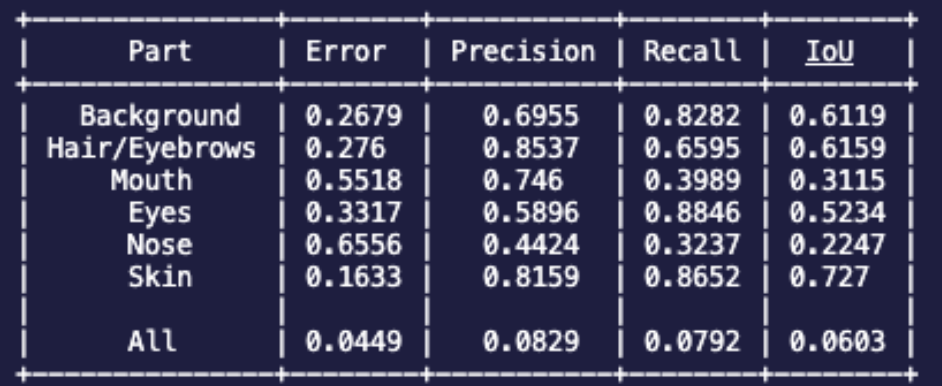

# Semantic Segmentation

Applying semantic segmentation on human faces using image processing techniques, as a part of my Visual Information Processing course. 

### Abstract

In this task, a face segmentation algorithm that relies only on image processing techniques is designed. The absence of more sophisticated techniques like deep learning means we have to more closely select relevant features, define areas of interest and create the right filters. It is also obvious that no one mask fits all images and any pipeline will have limitations. In this task, a workable pipeline is established with an average precision of 0.6905, involving various colour spaces, denoising strategies, region of interest definitions and masking.

### Pipeline

### Examples of Output

### Results
